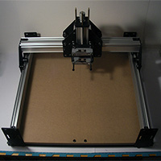
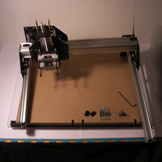
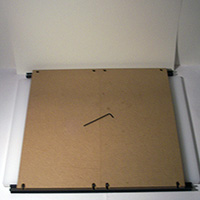
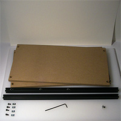
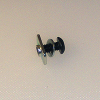

# Work Area

## Overview

##Waste Board Assembly (PS20024)

- 8 25286-02 M5 x 12mm, BHCS
- 8 25287-02 Flat Washer, M5
- 8 26016-01 M5 insertion nut
- 2 PS20001 MDF wasteboard (1/2")
- 2 PS20009 20mm x 20mm x 550mm aluminum extrusion, black anodized

   

### 20x20 Extrusions
Slide Entire  Assembly over wasteboard Assembly, fasten with:

- M5x10
- M5 washer
- Insertion Nut

### Squaring the Table

Square up the wasteboard assembly carefully, since it will be the foundation for the balance of the machine.

####Parts

* 2 Y-Axis Rail Assembly (PS20026)
* Complete Gantry (PS20025)
* Waste Board Assembly (PS20024)

Turn the eccentric nuts on the V-wheels on the Complete Gantry (PS20025) so that they are as far from the static V-wheels as is possible. Drive the Complete Gantry onto the two Y-Axis Rail Assemblies (PS20026), then attach the open end plates.

Place the 10mm M5 bolts w/ washers into the bottom holes on the open end plates, thread on the insertion nuts, then carefully slide the rail assemblies onto the wasteboard extrusion. Check the alignment with a known-to-be-good square. One can also measure the diagonals to test for squareness. Ensure that everything is aligned squarely and that the Complete Gantry and the X-Axis Sub Gantry move smoothly. Tighten the bolts.

Congratulations! You've built a ShapeOko!

At this point, you will need to adjust the machine's V-wheels. These should be tight enough to hold things in alignment, but loose enough that the machine moves freely and smoothly. The suggested technique for this is, "Loosen the eccentric spacer until the V-wheel does not rotate when the carriage is moving and then tighten just (and no more!) until the v-wheel rotates when moving the carriage. Overtightening will lead to the V-wheel wearing out."

You will also need to complete the wiring as documented in the next step.

